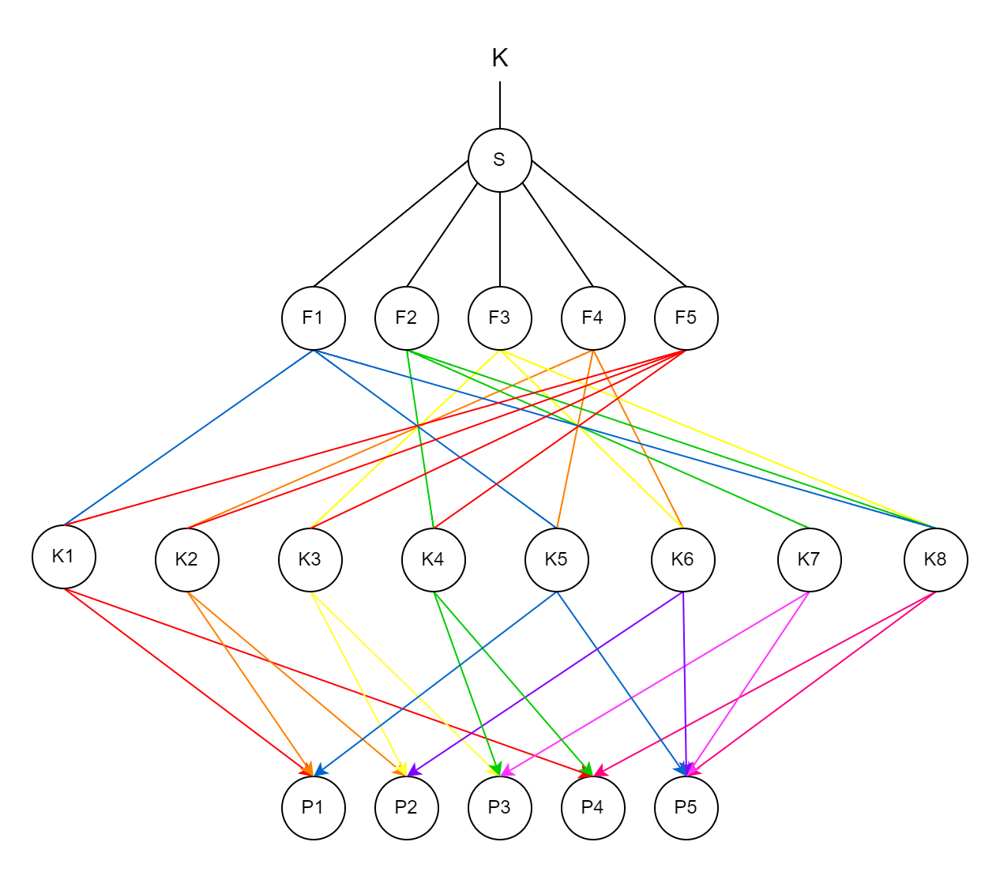

# Übungsblatt 2

## 2.1

<table>
    <tr><th>.</th><th>V (Verticles)</th><th>E (Edges)</th><th>F ()</th><th>L ()</th><th>S ()</th><th>Genus G = V - E + F - (L - F) - 2 ∙ (S - 0)</th></tr>
    <tr><td>a)</td><td>16</td><td>24</td><td>10</td><td>8</td><td>1</td><td>2</td></tr>
    <tr><td>b)</td><td>24</td><td>36</td><td>13</td><td>12</td><td>1</td><td>0</td></tr>
    <tr><td>c)</td><td>24</td><td>34</td><td>14</td><td>12</td><td>1</td><td>4</td></tr>
    <tr><td>d)</td><td>32</td><td>46</td><td>16</td><td>16</td><td>1</td><td>4</td></tr>
    <tr><td>e)</td><td>24</td><td>36</td><td>14</td><td>12</td><td>1</td><td>2</td></tr>
    <tr><td>f)</td><td>32</td><td>48</td><td>16</td><td>16</td><td>1</td><td>2</td></tr>
</table>

## 2.2

