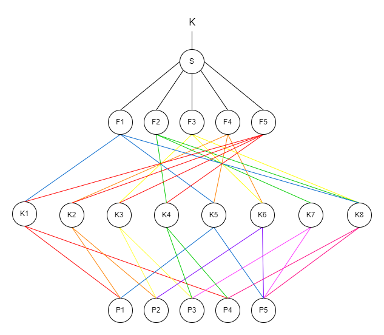

# Übungsblatt 2

## 2.1

| .  | V (Vertices) | E (Edges) | F (Facette) | L (Loop) | S (Shell) | Genus G = V - E + F - (L - F) - 2 ∙ (S - 0) |
|----|--------------|-----------|-------------|----------|-----------|---------------------------------------------|
| a) | 16           | 24        | 10          | 8        | 1         | 2                                           |
| b) | 24           | 36        | 13          | 12       | 1         | 0                                           |
| c) | 24           | 34        | 14          | 12       | 1         | 4                                           |
| d) | 32           | 46        | 16          | 16       | 1         | 4                                           |
| e) | 24           | 36        | 14          | 12       | 1         | 2                                           |
| f) | 32           | 48        | 16          | 16       | 1         | 2                                           |

## 2.2

## 2.3

updated Computergrafik/Übung2.3b

### a)

wenn der Normalenvektor der Ebene senkrecht zum richtungsvektor der gerade ist, so sind Ebene und Gerade parralel zueinander. Andernfalls schneiden Sie sich in einem Punkt.

$\cos \alpha = \frac{\vec{n}_0 \cdot \vec{v}}{\|\vec{n}_0\| \cdot \|\vec{v}\|}$

$\cos \alpha = \frac{\pmatrix{3 \cr 3 \cr -1} \cdot \pmatrix{4 \cr 1 \cr 2}}{\sqrt{3^2+3^2+(-1)^2} \cdot \sqrt{4^2+1^2+2^2}}$

$\cos \alpha = \frac{3 \cdot 4 + 3 \cdot 1 + (-1) \cdot 2}{\sqrt{3^2+3^2+(-1)^2} \cdot \sqrt{4^2+1^2+2^2}}$

$\cos \alpha = \frac{13}{\sqrt{399}}$

$\alpha = \cos^{-1} (\frac{13}{\sqrt{399}}) ≈ \underline{\underline{0,862140°}}$

Da der Normalenvektor der Ebene und der Richungsvektor der Gerade in einem spitzen Winkel zueinander stehen, schneidet die Gerade die ebene in einem Punkt.

### b)

1. Wenn der Graph die Ebene, die das Dreieck aufspannt schniedet, ist das eine hinreichende Bedingung dafür, das die Gerade das Dreieck schneidet.
2. Ist der Schnittpunkt mit der Ebene im Dreieck, dann sind alle baryzentrischen Koordinaten zwischen Punkt nd Dreieck im Intervall [0;1].

$g: \vec{x} = \pmatrix{-3 \cr 0 \cr 2} + t \pmatrix{4 \cr 1 \cr 2}$

#### Bestimmung der Kantenvektoren des Dreiecks

$\vec{k_{ac}} = \vec{ac} = \pmatrix{1,3 + 1 \cr 1,5 - 1 \cr 8 + 1} = \pmatrix{2,3 \cr 1,5 \cr 9}$

$\vec{_{ab}} = \vec{ab} = \pmatrix{2 + 1 \cr 0 - 1 \cr 0 + 1} = \pmatrix{3 \cr -1 \cr 1}$

#### Normalenvektor des Dreiecks bestimmen

$\vec{k_{ab}} \times \vec{k_{ac}} = \pmatrix{0,5 \cdot 1 - 9 \cdot (-1) \cr 9 \cdot 3 - 2,3 \cdot 1 \cr 2,3 \cdot (-1) - 0,5 \cdot 3} = \pmatrix{9,5 \cr 24,7 \cr -3,8}$

#### Koordinatenform der Ebene, in der das Dreieck liegt

$E:\ 0 = 9,5x + 24,7y -3,8z + a$

#### Stützvektor $\vec{a}$ einsetzen

$
E:\ 0 = 9,5(-1) + 24,7(1)-3,8(-1) + a \\
\ \ \ \ \ \ \ \ 0 = 19 + a | -19 \\
\ \ \ \ \ \ \ \ \underline{a = -19}
$

#### Geradengleichung in die Ebenengleichung einsetzen

$
E: 0 = 9,5x + 24,7y - 3,8z - 19 \\
\ \ \ \ \ \ \ 0 = 9,5(-3 +4t) + 24,7(t) - 3,8(2+2t) \\
\ \ \ \ \ \ \ 0 = -55,1 + 55,1t \\
\ 55,1 = 55,1t \\
\ \ \ \ \ \ \ t = 1
$

#### Einsetzen von $t=1$ in $g$

$g: \vec{x} = \pmatrix{-3 \cr 0 \cr 2} + 1 \pmatrix{4 \cr 1 \cr 2} = \pmatrix{1 \cr 1 \cr 4} \Rightarrow \underline{S(1 | 1 | 4)}$

Dreieck ABC mit $A(-1|1|-1)$, $B(2|0|0)$, $C(1,3|1,5|8)$

Schnittpunkt S mit $S(1|1|4)$

Bestimmung des Vektors vom Stützpunkt (der Ebene) zum Schnittpunkt

